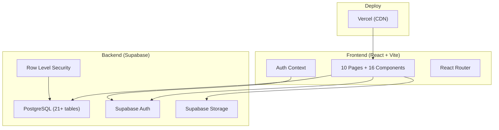

# Kiến trúc Hệ thống — MedLogixManage

## 1. Tổng quan kiến trúc



## 2. Tech Stack chi tiết

| Thành phần | Công nghệ | Phiên bản | Mục đích |
|---|---|---|---|
| **UI Framework** | React | 18.3 | Component-based SPA |
| **Build Tool** | Vite | 6.0 | Dev server + bundling |
| **Routing** | React Router DOM | 6.28 | Client-side routing |
| **Icons** | Lucide React | 0.475 | 1000+ SVG icons |
| **Charts** | Recharts | 2.15 | Dashboard KPI charts |
| **Database** | PostgreSQL (Supabase) | — | Dữ liệu persistent |
| **Auth** | Supabase Auth | — | Email/Password login |
| **Storage** | Supabase Storage | — | Upload chứng từ (bucket `documents`) |
| **Excel** | SheetJS (xlsx) | 0.18.5 | Import/export Price List |
| **Deploy** | Vercel | — | CI/CD + CDN |

## 3. Pages (10 trang)

| Trang | Route | File | Module |
|---|---|---|---|
| Login | `/login` | `LoginPage.jsx` | Auth |
| Dashboard | `/dashboard` | `DashboardPage.jsx` | Chung |
| Dự trù Sales | `/sales-forecast` | `SalesForecastPage.jsx` | M1 |
| Dự trù TH | `/purchase-forecast` | `PurchaseForecastPage.jsx` | M2 |
| Đặt hàng | `/purchase-orders` | `PurchaseOrderPage.jsx` | M3 |
| Nhập khẩu | `/import-shipments` | `ImportShipmentPage.jsx` | M4 |
| Nhập kho | `/warehouse` | `WarehouseReceiptPage.jsx` | M5 |
| Master Data | `/master-data` | `MasterDataPage.jsx` | Chung |
| Audit Trail | `/audit-trail` | `AuditTrailPage.jsx` | Chung |
| Profile | `/profile` | `ProfilePage.jsx` | Chung |

## 4. Components (16 tái sử dụng)

| Component | Chức năng |
|---|---|
| **Layout** | Sidebar navigation + theme toggle (Dark/Light) |
| **DataTable** | Searchable, sortable table + pagination + rows-per-page |
| **Modal** | Overlay dialog (`isOpen` default `true` — critical fix) |
| **NotificationBell** | Real-time alerts (HSD expiring, low stock, overdue POs) |
| **POTimeline** | Visual PO status tracking (9 steps) |
| **CrossVerificationPanel** | Side-by-side PO vs Invoice/PL/B/L comparison |
| **ConsumptionHistoryPanel** | 12-month product consumption trends (Recharts) |
| **RoleGuard** | Permissions-based access control per route |
| **FilterBar** | Dynamic filter UI (NCC dropdown, date range, status) |
| **StatCard** | KPI metric cards for Dashboard |
| **Toast** | Success/error/warning notifications |
| **ConfirmDialog** | Destructive action confirmation |
| **Badges** | Color-coded status badges |
| **SkeletonLoader** | Loading placeholder |
| **PageHeader** | Page title + action button |
| **EmptyState** | No-data placeholder with illustration |

## 5. Database Schema

### Phase 1 — Core (001_initial_schema.sql)

| Bảng | Mô tả | RLS |
|---|---|---|
| `profiles` | Users (6 roles), extends Supabase Auth | All read, self update |
| `products` | Master catalog (code, name, mfr, storage cond, TBYT class) | All read, admin modify |
| `hospitals` | 20 hospitals/clinics | All read, admin modify |
| `suppliers` | NCC (domestic flag, payment terms) | All read, admin modify |
| `carriers` | Transport companies (score, cold chain) | All read, admin modify |
| `sales_forecasts` | M1 header (code, status, approval workflow) | Creator + managers |
| `sales_forecast_items` | M1 items (product, hospital, qty, needed_date) | Follow parent |
| `purchase_forecasts` | M2 header (consolidation, status) | Logistics + admin |
| `purchase_forecast_items` | M2 items (stock calc, priority, supplier group) | Logistics + admin |
| `inventory_lots` | Stock by Lot/HSD (qty, reserved, quarantine) | All read, warehouse modify |
| `price_list` | SP × NCC price (ceiling, floor, validity, current flag) | All read, logistics modify |
| `audit_logs` | System log (user, action, old/new data as JSON) | Admin read only |

### Phase 2 — PO + Import + Warehouse (003_phase2_schema.sql)

| Bảng | Mô tả | RLS |
|---|---|---|
| `purchase_orders` | M3 PO (9 statuses, VAT calc, grand total) | Logistics + director |
| `po_items` | PO line items (lot, expiry, price deviation) | All read |
| `po_documents` | Cross-verify source (invoice/PL/BL data) | All read |
| `po_document_items` | Parsed document line items | All read |
| `verification_results` | Cross-check results (matched/mismatched + detail) | All read |
| `import_shipments` | M4 (CIF calc, 6 status steps, customs) | Logistics + director |
| `import_documents` | 8 document types with upload URL + cross-check | All read |
| `warehouse_receipts` | M5 (cross-verify status, receipt date) | Warehouse + logistics |
| `receipt_items` | Receipt items (actual qty, discrepancy, quarantine) | All read |

## 6. Bảo mật (Row Level Security)

Mọi bảng đều bật **RLS**. Helper function `get_my_role()` trả về vai trò user hiện tại.

| Tài nguyên | SELECT | INSERT/UPDATE/DELETE |
|---|---|---|
| Master Data (products, hospitals, suppliers, carriers) | Tất cả | Admin only |
| Sales Forecasts | Creator + managers | Sales + Admin |
| Purchase Forecasts | Managers (sales, logistics, director, admin) | Logistics + Admin |
| Purchase Orders | Logistics + Director + Admin | Logistics + Admin (Director can approve) |
| Import Shipments | Logistics + Director + Admin | Logistics + Admin |
| Warehouse Receipts | Warehouse + Logistics + Director + Admin | Warehouse + Logistics + Admin |
| Audit Logs | Admin only | System (any authenticated) |

## 7. Key Business Logic

### helpers.js — Hàm nghiệp vụ cốt lõi

```javascript
// Tính mức ưu tiên dựa trên deadline + tồn kho
calculatePriority(neededDate, availableStock, totalRequested)
// → 'urgent' | 'normal' | 'low'

// Cảnh báo HSD tồn kho
getExpiryWarning(expiryDate, neededDate)
// → { level: 'danger'|'warning'|'ok', label, color }

// Mã tự sinh theo timestamp
generateCode(prefix) // → 'PO-20260308-14302255'

// Format tiền tệ VN
formatCurrency(amount, currency) // → '350.000.000 ₫'
```

### Auto PO Creation (FR-2.8)

Khi duyệt Purchase Forecast → `handleApprove()`:
1. Validate: tất cả items phải có `supplier_id`
2. Filter items có `qty_to_purchase > 0`
3. Group by `supplier_id` → mỗi NCC 1 PO draft
4. Lookup `price_list` (`is_current = true`) cho unit price
5. Lookup `suppliers.is_domestic` + `payment_terms`
6. Tính VAT 8%, insert PO + PO items
7. Update forecast status → `po_created`
8. Navigate to `/purchase-orders`

### Excel Price List Import (FR-3.5)

Dynamic import SheetJS → parse Vietnamese columns:

| Cột Excel | Database Field |
|---|---|
| Mã SP | `product_code` → `product_id` |
| NCC | `supplier_name` → `supplier_id` |
| Đơn giá | `unit_price` |
| Tiền tệ | `currency` |
| Giá trần / Giá sàn | `price_ceiling` / `price_floor` |
| Hiệu lực từ / đến | `valid_from` / `valid_to` |

Old prices set `is_current = false`, new entry `is_current = true`.

### Document Upload (FR-S.3)

- Storage bucket: `documents` (Private)
- Path: `imports/{shipment_id}/{doc_type}_{timestamp}.{ext}`
- Policy: authenticated users → SELECT, INSERT, UPDATE, DELETE

## 8. Performance Indexes

```sql
-- Phase 1
idx_products_code, idx_products_name (GIN full-text)
idx_sf_status, idx_sf_created_by
idx_sfi_forecast, idx_sfi_product
idx_inv_product, idx_inv_expiry

-- Phase 2
idx_po_status, idx_po_supplier
idx_poi_po, idx_poi_product
idx_is_po, idx_is_status
idx_wr_shipment, idx_wr_status
idx_ri_receipt
```
