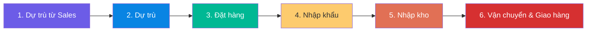
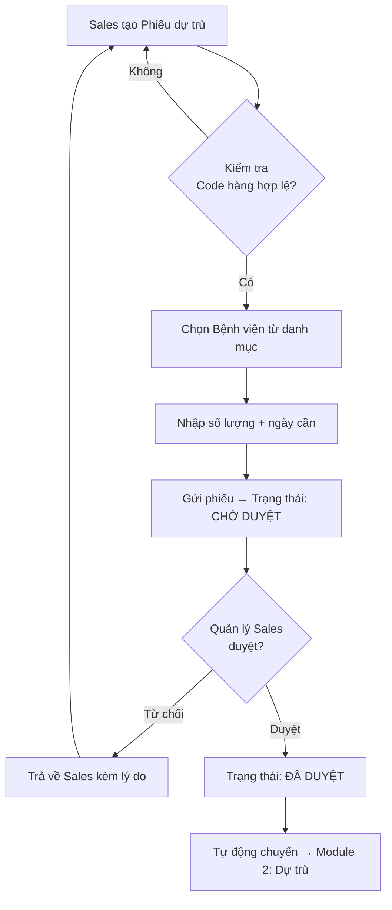
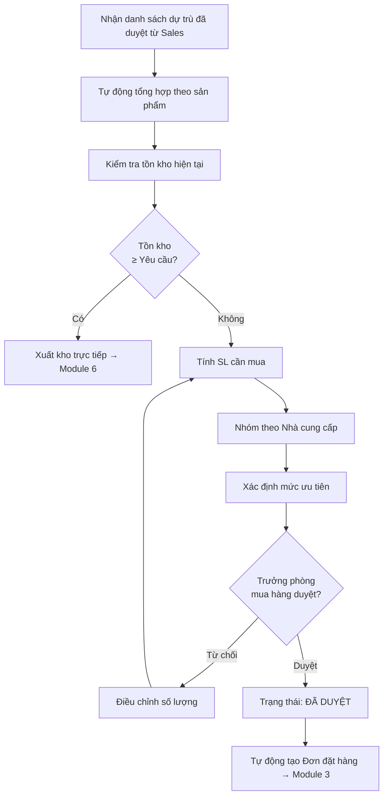
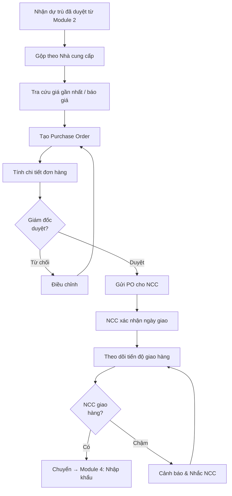
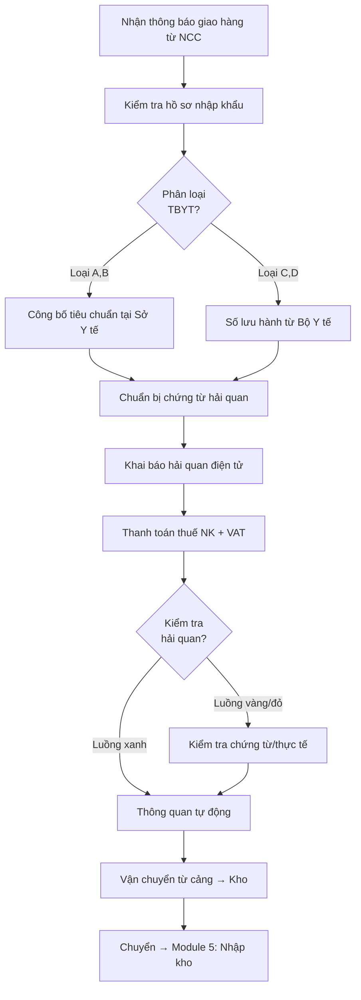
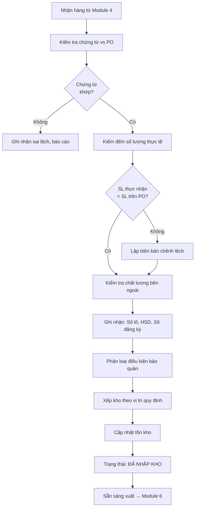
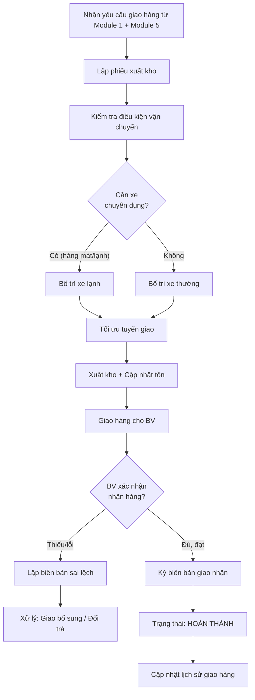
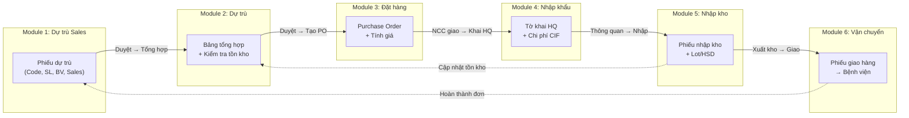
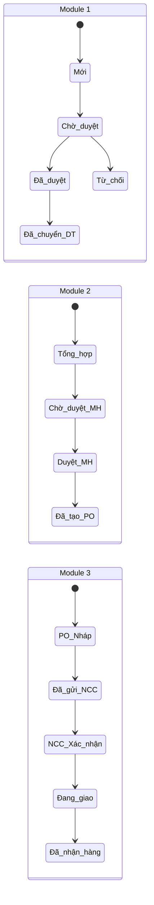

# Phân tích Quy trình Nghiệp vụ - MedLogixManage

## Tổng quan Hệ thống

Hệ thống MedLogixManage quản lý **chuỗi cung ứng thiết bị y tế & dược phẩm** từ khâu dự trù nhu cầu đến giao hàng cho cơ sở y tế, tuân thủ các tiêu chuẩn:

| Tiêu chuẩn | Mô tả | Áp dụng |
|---|---|---|
| **GSP** | Thực hành tốt bảo quản thuốc (TT 36/2018/TT-BYT) | Nhập kho, Bảo quản |
| **GDP** | Thực hành tốt phân phối thuốc (TT 03/2018/TT-BYT) | Vận chuyển, Giao hàng |
| **NĐ 98/2021** | Quản lý trang thiết bị y tế | Nhập khẩu, Phân loại |
| **ISO 13485** | Quản lý chất lượng thiết bị y tế | Toàn quy trình |
| **FIFO/FEFO** | Nhập trước xuất trước / Hết hạn trước xuất trước | Quản lý kho |

### Luồng quy trình tổng thể (End-to-End)



---

## Module 1: Dự trù từ Sales (Sales Forecast Request)

### 1.1 Nhận định vấn đề

| Vấn đề | Mô tả | Hệ quả |
|---|---|---|
| **Nhu cầu phân tán** | Mỗi Sales gửi yêu cầu riêng lẻ cho từng bệnh viện | Khó tổng hợp, trùng lặp |
| **Thiếu thông tin chuẩn** | Sales có thể ghi sai Code hàng, bỏ qua hãng SX | Mua nhầm sản phẩm |
| **Không kiểm soát deadline** | Không rõ ngày cần hàng → không ưu tiên mua hàng đúng | Giao hàng trễ |
| **Phân bổ Sales chồng chéo** | Nhiều Sales cùng yêu cầu cho 1 bệnh viện | Đặt hàng thừa |

### 1.2 Quy trình nghiệp vụ



### 1.3 Cấu trúc dữ liệu (từ Excel + bổ sung)

| Trường | Nguồn | Kiểu | Bắt buộc | Ghi chú |
|---|---|---|---|---|
| Mã phiếu dự trù | Hệ thống | Auto ID | ✅ | VD: `DT-SALES-2026-0001` |
| Tên bảng dự trù | Excel R1 | Text | ✅ | "Tên SP cần dự trù - ngày yêu cầu" |
| STT | Excel C1 | Number | ✅ | Tự tăng |
| Code hàng | Excel C2 | Text | ✅ | Mã sản phẩm nội bộ |
| Tên hàng | Excel C3 | Text | ✅ | Tra cứu từ danh mục SP |
| Hãng sản xuất | Excel C4 | Text | ✅ | **Tự điền** khi chọn Code hàng |
| Quy cách đóng gói | Excel C5 | Text | ✅ | **Tự điền** khi chọn Code hàng |
| Đơn vị tính | Excel C6 | Text | ✅ | **Tự điền** khi chọn Code hàng |
| Số lượng | Excel C7 | Number | ✅ | Sales nhập tay |
| Bệnh viện/Cơ sở y tế | Excel C8-C11 | Dropdown | ✅ | 20 BV từ validation Excel |
| Nhân viên Sales | Excel C8-C11 | Dropdown | ✅ | A.Thái, A.Phương, A.Hoàng, A.Cao |
| **Lịch sử tiêu thụ** | Hệ thống | Table (readonly) | ✅ | Hiển thị SL tiêu thụ thực tế của Code hàng này tại BV được chọn, theo từng tháng/quý (lấy từ lịch sử giao hàng Module 6). Dùng làm căn cứ tham khảo khi duyệt phiếu |
| Ngày yêu cầu | Bổ sung | Date | ✅ | |
| Ngày cần hàng | Bổ sung | Date | ✅ | Deadline giao cho BV |
| Trạng thái | Bổ sung | Enum | ✅ | Mới → Chờ duyệt → Đã duyệt → Đã chuyển |
| Ghi chú | Bổ sung | Text | | |

### 1.4 Danh mục Bệnh viện (từ Excel Validation)

> [!NOTE]
> 20 cơ sở y tế trích từ dropdown validation trong cell C8R4 của sheet "Dự trù từ Sales":

BV Bắc Quảng Bình, BV C Đà Nẵng, BV CTCH Nghệ An, BV CuBa-Đồng Hới, BV Đà Nẵng, BV E Đà Nẵng, BV Hữu Nghị Nghệ An, BV Sản Nhi Nghệ An, BV Ung Bướu Nghệ An, BVĐK Cửa Đông, BVĐK Minh An, BVĐK Minh Thành, BVĐK Quang Khởi, BVĐK Quảng Trị, BVTW Huế, TTHHTM Nghệ An, TTKSBT Nghệ An, TTYT Anh Sơn, TTYT Nam Đàn, TTYT Qùy Châu

---

## Module 2: Dự trù (Purchase Forecast / Tổng hợp mua hàng)

### 2.1 Nhận định vấn đề

| Vấn đề | Mô tả | Hệ quả |
|---|---|---|
| **Tổng hợp thủ công** | Gộp nhiều phiếu Sales thành 1 kế hoạch mua | Sai sót, mất thời gian |
| **Không đối chiếu tồn kho** | Mua mà không biết tồn kho bao nhiêu | Tồn kho thừa, vốn đọng |
| **Không kiểm tra HSD tồn kho** | Tồn kho có nhưng hạn sử dụng quá sát → không dùng được | Giao hàng gần hết hạn cho BV, vi phạm chất lượng |
| **Không cảnh báo nhiệt độ bảo quản** | Mua hàng yêu cầu bảo quản đặc biệt nhưng không biết trước | Hư hỏng SP do bảo quản sai, tốn chi phí |
| **Không ưu tiên** | Mọi yêu cầu như nhau, không phân loại khẩn cấp | Thiếu SP quan trọng |
| **Thiếu dự báo** | Chỉ mua theo yêu cầu, không dự báo xu hướng | Phản ứng chậm |

### 2.2 Quy trình nghiệp vụ



### 2.3 Công thức tính toán

```
Số lượng cần mua = Tổng SL yêu cầu từ Sales - Tồn kho khả dụng - SL đang trên đường về
                 = MAX(0, ΣSL_YêuCầu - SL_TồnKho_KhảDụng - SL_ĐangVề)

# Tồn kho khả dụng: chỉ tính hàng có HSD còn ≥ 8 tháng (hoặc ≥ 12 tháng tùy cấu hình)
Tồn kho khả dụng = Tồn kho có HSD ≥ Ngưỡng_HSD_Tối_Thiểu

Mức tồn kho an toàn = Trung bình tiêu thụ 3 tháng × Hệ số an toàn (1.2~1.5)
```

#### Giải thích "Đề xuất mua thêm"

Đây là trường thông tin **bổ sung** ngoài "SL cần mua", giúp quản lý chủ động dự phòng:

```
Đề xuất mua thêm = MAX(0, Mức tồn kho an toàn - Tồn kho khả dụng - SL đang về)
```

- **Khi nào hiển thị?** Khi tồn kho khả dụng + SL đang về < Mức tồn kho an toàn
- **Ý nghĩa:** Dù đủ hàng cho đơn Sales hiện tại, nhưng nếu không mua thêm thì sẽ rơi dưới mức an toàn, dẫn đến nguy cơ thiếu hàng trong tương lai
- **Quyết định cuối:** Quản lý xem xét và quyết định có mua thêm hay không (trường "SL duyệt mua")

#### Cảnh báo HSD tồn kho

```
⚠️ Cảnh báo HSD sát:  HSD tồn kho - Ngày cần hàng ≤ 8 tháng  → CẢNH BÁO VÀNG
🔴 Cảnh báo HSD nguy hiểm: HSD tồn kho - Ngày cần hàng ≤ 12 tháng → CẢNH BÁO ĐỎ (khuyên mua mới)
```

> [!WARNING]
> Hàng tồn kho có HSD quá sát (dưới 8 hoặc 12 tháng so với ngày cần giao) sẽ **không được tính** vào tồn kho khả dụng → hệ thống tự động đề xuất mua mới.

#### Cảnh báo nhiệt độ bảo quản

```
❄️ Cảnh báo bảo quản đặc biệt: Nếu Code hàng yêu cầu nhiệt độ bảo quản ≠ "Thường"
   → Hiển thị: "SP này yêu cầu bảo quản [Mát 2-8°C / Lạnh -20°C]" (tham chiếu từ Packing List)
   → Kiểm tra kho có đủ capacity bảo quản đặc biệt không
```

### 2.4 Cấu trúc dữ liệu

| Trường | Kiểu | Công thức/Logic |
|---|---|---|
| Mã phiếu dự trù | Auto ID | `DT-2026-0001` |
| Ngày tổng hợp | Date | Ngày tạo phiếu |
| Code hàng | Text | Từ Module 1 |
| Tên hàng | Text | Từ danh mục |
| Hãng SX | Text | Từ danh mục |
| **Lịch sử tiêu thụ theo BV** | Table (readonly) | Hiển thị SL tiêu thụ thực tế của Code hàng tại từng BV theo tháng/quý (từ lịch sử giao hàng Module 6). Căn cứ để quản lý duyệt lần 2 |
| **Yêu cầu bảo quản** | Enum | Thường / Mát (2-8°C) / Lạnh (-20°C). Tham chiếu từ Packing List |
| Tổng SL yêu cầu | Number | `=SUM(SL từ tất cả phiếu Sales đã duyệt)` |
| Tồn kho hiện tại | Number | Từ Module 5 |
| **HSD tồn kho gần nhất** | Date | HSD ngắn nhất của các lô tồn kho. ⚠️ nếu < 8 tháng |
| **Tồn kho khả dụng** | Number | Chỉ tính lô có HSD ≥ 8 tháng |
| SL đang trên đường về | Number | Từ Module 4 (đang vận chuyển) |
| **SL cần mua** | Number | `=MAX(0, Tổng_YC - Tồn_KhảDụng - Đang_Về)` |
| **Đề xuất mua thêm** | Number | `=MAX(0, Mức_An_Toàn - Tồn_KhảDụng - Đang_Về)` |
| **SL duyệt mua** | Number | Quản lý quyết định cuối |
| Nhà cung cấp | Dropdown | Từ danh mục NCC |
| Mức ưu tiên | Enum | Khẩn / Bình thường / Thấp (xem giải thích bên dưới) |
| Trạng thái | Enum | Chờ duyệt → Đã duyệt → Đã tạo PO |

#### 2.5 Giải thích Mức độ ưu tiên

| Mức | Điều kiện | Lý do |
|---|---|---|
| 🔴 **Khẩn** | Ngày cần hàng ≤ 15 ngày tới **HOẶC** hàng đấu thầu có deadline **HOẶC** tồn kho = 0 | Ưu tiên đặt hàng ngay, chọn NCC giao nhanh nhất (kể cả giá cao hơn). BV chờ hàng khẩn cấp (phẫu thuật, cấp cứu) |
| 🟡 **Bình thường** | Ngày cần hàng 15-45 ngày **VÀ** tồn kho khả dụng < Mức an toàn | Quy trình mua hàng tiêu chuẩn, so giá NCC, tối ưu chi phí |
| 🟢 **Thấp** | Ngày cần hàng > 45 ngày **VÀ** tồn kho khả dụng ≥ Mức an toàn | Có thể gộp với đơn khác để tối ưu phí vận chuyển, chờ giá tốt |

---

## Module 3: Đặt hàng (Purchase Order)

### 3.1 Nhận định vấn đề

| Vấn đề | Mô tả | Hệ quả |
|---|---|---|
| **Thiếu kiểm soát giá** | Không so sánh giá giữa các NCC/lần mua, không có bảng giá chuẩn | Chi phí cao, mua giá sai |
| **Không đối chiếu chứng từ** | Không check thông tin PO vs Invoice vs Packing List vs B/L | Sai lệch SL, mã hàng không khớp |
| **Không theo dõi tiến độ** | Đặt rồi không biết NCC giao khi nào | Trễ hàng |
| **Đơn hàng phân tán** | Mỗi SP đặt 1 đơn riêng → phí vận chuyển cao | Lãng phí logistics |
| **Thiếu ràng buộc hợp đồng** | Không rõ điều khoản phạt chậm giao | NCC ít động lực giao đúng |
| **Thiếu quản lý Lot/HSD** | Mỗi code hàng có nhiều lot với HSD khác nhau, nhưng không theo dõi | Nhận hàng gần hết hạn mà không biết |

> [!IMPORTANT]
> **Bảng giá chuẩn (Price List):** Quản lý Logistics import vào hệ thống danh sách giá cho từng mã hàng. Khi tạo PO, hệ thống tự động tra cứu giá từ Price List + so sánh với giá mua lần gần nhất để cảnh báo biến động.

### 3.2 Quy trình nghiệp vụ



### 3.3 Công thức tính toán

```
Thành tiền (1 dòng)  = Số lượng × Đơn giá
Tổng tiền hàng       = Σ(Thành tiền)
Thuế VAT             = Tổng tiền hàng × %VAT (thường 8% cho TBYT)
Phí vận chuyển (VND) = Theo thỏa thuận NCC hoặc theo hợp đồng
Tổng giá trị PO      = Tổng tiền hàng + Thuế VAT + Phí vận chuyển

Chênh lệch giá       = Đơn giá lần này - Đơn giá lần mua gần nhất
% Biến động giá       = (Chênh lệch giá / Đơn giá cũ) × 100%
```

### 3.4 Cấu trúc dữ liệu

| Trường | Kiểu | Ghi chú |
|---|---|---|
| Số PO | Auto ID | `PO-2026-0001` |
| Ngày tạo PO | Date | |
| Nhà cung cấp | FK → NCC | Tên, MST, ĐC, SĐT |
| **Ngày giao dự kiến** | Date | Lấy từ B/L (Bill of Lading) hoặc AWB (Airway Bill) **+ 1 ngày**. Tài liệu B/L/AWB được import vào hệ thống sau |
| Ngày giao thực tế | Date | Cập nhật khi nhận hàng |
| **Chi tiết PO** | | |
| → Code hàng | Text | ✅ Check đối chiếu với Invoice & Packing List |
| → Tên hàng | Text | ✅ Check đối chiếu với Invoice & Packing List |
| → ĐVT | Text | ✅ Check đối chiếu với Invoice & Packing List |
| → Số lượng đặt | Number | ✅ Check đối chiếu với Invoice, Packing List & B/L |
| → **Lot No.** | Text | Mỗi code hàng có thể ≥ 2 lot khác nhau |
| → **Expired Date** | Date | Mỗi lot có HSD riêng |
| → Đơn giá | Currency | VND. Đối chiếu với Price List được import bởi QL Logistics |
| → **Giá Price List** | Currency | Giá chuẩn từ bảng giá import. ⚠️ Cảnh báo nếu đơn giá ≠ giá Price List |
| → **Thành tiền** | Currency | `= SL × Đơn giá` |
| Tổng tiền hàng | Currency | `= Σ Thành tiền` |
| VAT | Currency | `= Tổng × %VAT` |
| **Tổng giá trị PO** | Currency | `= Tổng + VAT + Ship` |
| Điều khoản thanh toán | Text | COD, 30 ngày, LC... |
| Trạng thái | Enum | Nháp → Đã gửi → Xác nhận → Đang giao → Đã nhận |

> [!IMPORTANT]
> **Cross-verification bắt buộc:** Khi import Invoice, Packing List, AWB/B/L vào hệ thống, các trường **Code hàng, Tên hàng, ĐVT, Số lượng** phải được hệ thống tự động đối chiếu với PO. Nếu không khớp → hiển cảnh báo và yêu cầu xác nhận thủ công.

---

## Module 4: Nhập khẩu (Import / Customs Clearance)

### 4.1 Nhận định vấn đề

| Vấn đề | Mô tả | Hệ quả |
|---|---|---|
| **Thủ tục phức tạp** | TBYT phân loại A/B/C/D, mỗi loại thủ tục khác | Chậm thông quan |
| **Nhiều chứng từ** | CFS, CO, Invoice, Packing List, Số lưu hành | Thiếu sót → giữ hàng |
| **Chi phí ẩn** | Thuế NK + VAT + phí lưu kho/bãi + demurrage | Vượt ngân sách |
| **Thời gian không xác định** | Không biết khi nào hàng qua cửa khẩu | Không lên kế hoạch được |

### 4.2 Quy trình nghiệp vụ (theo NĐ 98/2021/NĐ-CP)



### 4.3 Công thức tính toán

```
Giá CIF            = Giá FOB + Phí vận chuyển quốc tế (Freight) + Bảo hiểm (Insurance)
Thuế nhập khẩu     = Giá CIF × %Thuế NK (tra biểu thuế theo mã HS)
Giá tính thuế VAT  = Giá CIF + Thuế NK
Thuế VAT           = Giá tính thuế VAT × %VAT (5% cho TBYT có giấy phép, 8% khác)
Phí lưu kho/bãi    = Số ngày × Đơn giá lưu kho
Phí hải quan        = Theo biểu phí

Tổng chi phí NK     = Giá CIF + Thuế NK + VAT + Phí lưu kho + Phí hải quan + Phí khác
Giá vốn nhập kho    = Tổng chi phí NK / Tổng số lượng
```

### 4.4 Cấu trúc dữ liệu

| Trường | Kiểu | Ghi chú |
|---|---|---|
| Mã lô nhập | Auto ID | `NK-2026-0001` |
| Liên kết PO | FK → PO | Số PO gốc |
| Số tờ khai hải quan | Text | |
| Ngày khai báo | Date | |
| Cảng đến | Text | Hải Phòng, Đà Nẵng... |
| Mã HS | Text | Mã hàng hóa hải quan |
| Phân loại TBYT | Enum | A / B / C / D |
| Số lưu hành / CBTA | Text | |
| **Checklist chứng từ** | | |
| → ☐ Commercial Invoice | Checkbox + File | ✅ Bắt buộc. Import file → hệ thống cross-check với PO |
| → ☐ Packing List | Checkbox + File | ✅ Bắt buộc. Cross-check: Code, Tên, SL, ĐVT, Lot, HSD |
| → ☐ Bill of Lading / Airway Bill | Checkbox + File | ✅ Bắt buộc. Cross-check: SL, ngày giao |
| → ☐ Certificate of Origin (C/O) | Checkbox + File | Tùy loại hàng |
| → ☐ Free Sale Certificate (CFS) | Checkbox + File | Bắt buộc với TBYT loại C, D |
| → ☐ ISO 13485 Certificate | Checkbox + File | Chứng nhận nhà SX |
| → ☐ Số lưu hành / CBTA | Checkbox + File | Theo phân loại TBYT |
| → ☐ Giấy phép nhập khẩu | Checkbox + File | Nếu cần |
| **Kết quả cross-check** | Auto | ✅ Khớp / ⚠️ Sai lệch (chi tiết trường nào không khớp) |
| **Chi phí** | | |
| → Giá FOB | Currency | USD |
| → Phí Freight | Currency | USD |
| → Phí Insurance | Currency | USD |
| → **Giá CIF** | Currency | `= FOB + Freight + Insurance` |
| → Tỷ giá | Number | VND/USD |
| → Giá CIF (VND) | Currency | `= CIF × Tỷ giá` |
| → Thuế NK | Currency | `= CIF_VND × %Thuế` |
| → VAT | Currency | `= (CIF_VND + Thuế_NK) × %VAT` |
| → Phí khác | Currency | Lưu kho, HC, vận chuyển nội địa |
| → **Tổng chi phí** | Currency | `= Σ tất cả chi phí` |
| Trạng thái | Enum | Đang vận chuyển → Đến cảng → Khai báo HQ → Thông quan → VC nội địa → Hoàn thành |

> [!WARNING]
> **Không cho phép khai báo hải quan** nếu checklist chứng từ chưa đủ (☐ còn trống với các mục bắt buộc). Hệ thống block chuyển trạng thái “Khai báo HQ” cho đến khi tất cả tài liệu bắt buộc đã được import và cross-check đạt.

---

## Module 5: Nhập kho (Warehouse Receipt)

### 5.1 Nhận định vấn đề

| Vấn đề | Mô tả | Hệ quả |
|---|---|---|
| **Không kiểm kê đối chiếu** | Nhận hàng không đếm/kiểm tra chất lượng | Thiếu hụt, hàng lỗi |
| **Thiếu truy xuất lô** | Không ghi Số lô, HSD → không thu hồi được | Vi phạm GSP |
| **Không theo FIFO/FEFO** | Xuất kho ngẫu nhiên → hàng hết hạn trong kho | Thiệt hại, rủi ro pháp lý |
| **Bảo quản không đúng** | TBYT nhạy cảm không đúng nhiệt độ/độ ẩm | Giảm chất lượng SP |
| **Tồn kho không chính xác** | Sổ sách và thực tế chênh lệch | Dự trù sai |

### 5.2 Quy trình nghiệp vụ (theo GSP - TT 36/2018/TT-BYT)



### 5.3 Công thức tính toán

```
SL thực nhận        = Kiểm đếm tay
Chênh lệch          = SL trên PO - SL thực nhận
% Chênh lệch        = (Chênh lệch / SL trên PO) × 100%

Tồn kho sau nhập    = Tồn kho trước + SL thực nhận
Giá vốn bình quân   = (Tồn cũ × Giá cũ + SL mới × Giá mới) / (Tồn cũ + SL mới)

Giá trị tồn kho     = Σ(SL tồn × Giá vốn bình quân)

Cảnh báo hết hạn    = HSD - Ngày hiện tại ≤ 90 ngày → ⚠️
Cảnh báo tồn kho thấp = Tồn kho ≤ Mức tồn kho an toàn → ⚠️
```

### 5.4 Cấu trúc dữ liệu

| Trường | Kiểu | Ghi chú |
|---|---|---|
| Mã phiếu nhập | Auto ID | `PNK-2026-0001` |
| Liên kết NK / PO | FK | Từ Module 4 / Module 3 |
| Ngày nhập kho | Date | |
| Người nhận | Text | Thủ kho |
| **Chi tiết nhập** | | |
| → Code hàng | Text | ✅ Auto cross-check với Invoice & Packing List |
| → Tên hàng | Text | ✅ Auto cross-check với Invoice & Packing List |
| → **Số lô (Lot No.)** | Text | ✅ Bắt buộc theo GSP. Cross-check với Packing List |
| → **Hạn sử dụng (HSD)** | Date | ✅ Bắt buộc. Cross-check với Packing List |
| → Số đăng ký | Text | Số lưu hành BYT |
| → ĐVT | Text | ✅ Cross-check với Invoice & Packing List |
| → SL trên PO | Number | |
| → **SL thực nhận** | Number | Kiểm đếm. ✅ Cross-check với Packing List |
| → Chênh lệch | Number | `= SL_PO - SL_ThựcNhận` |
| → Đơn giá vốn | Currency | Từ Module 4 |
| → **Thành tiền** | Currency | `= SL × Đơn giá vốn` |
| **Kết quả cross-check** | Auto | ✅ Khớp / ⚠️ Sai lệch (liệt kê trường không khớp) |
| Vị trí kho | Text | Kệ, tầng, ô |
| Điều kiện bảo quản | Enum | Thường / Mát (2-8°C) / Lạnh (-20°C) |
| Trạng thái | Enum | Chờ kiểm tra → Đã nhập → Biệt trữ → Xuất kho |

> [!IMPORTANT]
> **Auto cross-verification sau nhập liệu:** Sau khi thủ kho nhập dữ liệu, hệ thống tự động đối chiếu các trường (Code hàng, Tên hàng, SL, ĐVT, Lot, HSD) với thông tin trên Invoice và Packing List đã import ở Module 4. Nếu có sai lệch → hiển cảnh báo chi tiết và yêu cầu xác nhận thủ công trước khi hoàn tất nhập kho.

---

## Module 6: Đơn vị vận chuyển (Shipping / Delivery)

### 6.1 Nhận định vấn đề

| Vấn đề | Mô tả | Hệ quả |
|---|---|---|
| **Giao hàng không đúng hẹn** | Không kiểm soát lịch giao | Mất uy tín, BV phàn nàn |
| **Không tối ưu tuyến** | Mỗi BV giao riêng → chi phí cao | Lãng phí |
| **Không theo dõi thực tế** | Không biết xe đang ở đâu | Khó xử lý sự cố |
| **Thiếu biên bản giao nhận** | Giao xong không có xác nhận | Tranh chấp |
| **Vi phạm GDP** | Vận chuyển TBYT cần bảo quản nhưng xe không đạt chuẩn | Vi phạm pháp luật |

### 6.2 Quy trình nghiệp vụ (theo GDP - TT 03/2018/TT-BYT)



### 6.3 Công thức tính toán

```
SL xuất kho          = Theo phiếu yêu cầu
Tồn kho sau xuất     = Tồn kho trước - SL xuất

Chi phí vận chuyển   = Khoảng cách × Đơn giá/km (hoặc phí cố định theo tuyến)
Thời gian giao hàng  = Ngày giao thực tế - Ngày xuất kho
% Giao đúng hẹn      = (Số đơn đúng hẹn / Tổng đơn) × 100%
```

#### Công thức chấm điểm đơn vị vận chuyển

```
Điểm = (PhảnHồiNhanh + GiaoDungHen + KhongBomHang + GiaoNguyenVen + KhongPhatSinhChi) / 5

Mỗi tiêu chí: Có = 1 điểm, Không = 0 điểm
Điểm trung bình tích lũy = Tổng điểm tất cả đơn / Tổng số đơn

Xếp hạng: ≥ 0.8 = ⭐ Xuất sắc | ≥ 0.6 = 👍 Tốt | ≥ 0.4 = ⚠️ Trung bình | < 0.4 = 🔴 Kém
```

### 6.4 Cấu trúc dữ liệu

| Trường | Kiểu | Ghi chú |
|---|---|---|
| Mã phiếu giao | Auto ID | `PGH-2026-0001` |
| Liên kết dự trù Sales | FK | Từ Module 1 |
| **Điểm giao hàng (xuất phát)** | Text | Địa chỉ kho xuất hàng |
| **Điểm nhận hàng (đích)** | Text | Địa chỉ BV nhận hàng |
| Bệnh viện nhận | FK → BV | Từ danh mục 20 BV |
| Ngày xuất kho | Date | |
| Ngày giao dự kiến | Date | |
| Ngày giao thực tế | Date | |
| **Đơn vị vận chuyển** | | Khi nhập tuyến (điểm giao + điểm nhận) → hệ thống **tự động gợi ý** đơn vị VC có điểm cao nhất trên tuyến này |
| → Tên đơn vị VC | Text | Nội bộ hoặc 3PL |
| → Biển số xe | Text | |
| → Tài xế | Text | |
| → SĐT tài xế | Text | |
| **Chi tiết giao** | | |
| → Code hàng | Text | |
| → Tên hàng | Text | |
| → Số lô | Text | Truy xuất từ Module 5 |
| → HSD | Date | |
| → SL giao | Number | |
| → SL BV xác nhận | Number | |
| Điều kiện vận chuyển | Enum | Thường / Mát / Lạnh |
| Biên bản giao nhận | File | Ảnh/scan |
| **Đánh giá chất lượng VC** | | Nhập sau khi giao hàng xong |
| → Phản hồi nhanh? | Boolean | Có / Không |
| → Giao hàng đúng hẹn? | Boolean | Có / Không |
| → Có bom hàng? | Boolean | Có / Không (Không = tốt) |
| → Giao hàng nguyên vẹn? | Boolean | Có / Không |
| → Phát sinh chi phí? | Boolean | Có / Không (Không = tốt) |
| → **Điểm lần này** | Auto Number | `= (5 tiêu chí) / 5` (0.0 - 1.0) |
| → **Điểm TB tích lũy** | Auto Number | Trung bình tất cả đơn của đơn vị VC này |
| Trạng thái | Enum | Chờ xuất kho → Đang giao → Đã giao → BV xác nhận → Hoàn thành |

---

## Liên kết dữ liệu giữa các Module

### Luồng dữ liệu chính



### Bảng tham chiếu khóa ngoại

| Từ Module | Sang Module | Khóa liên kết | Mục đích |
|---|---|---|---|
| 1 → 2 | Sales → Dự trù | `Mã phiếu dự trù Sales` | Tổng hợp nhu cầu |
| 2 → 3 | Dự trù → Đặt hàng | `Mã phiếu dự trù` | Tạo PO từ dự trù đã duyệt |
| 3 → 4 | Đặt hàng → Nhập khẩu | `Số PO` | Theo dõi lô hàng theo PO |
| 4 → 5 | Nhập khẩu → Nhập kho | `Mã lô nhập` | Nhập kho hàng đã thông quan |
| 5 → 6 | Nhập kho → Vận chuyển | `Mã phiếu nhập, Lot No.` | Truy xuất lô khi giao |
| 6 → 1 | Vận chuyển → Sales | `Mã phiếu dự trù Sales` | Đóng vòng: đã giao xong |
| 5 ↔ 2 | Nhập kho ↔ Dự trù | `Code hàng` | Kiểm tra tồn kho real-time |

---

## Tổng kết các trạng thái quy trình



> [!TIP]
> **Nguyên tắc quản lý kho TBYT cốt lõi:**
> - **FEFO** (First Expired, First Out): Hàng hết hạn trước → xuất trước
> - **Truy xuất lô**: Mỗi SP phải có Số lô + HSD để thu hồi khi cần
> - **Biệt trữ**: Hàng nghi ngờ chất lượng → cách ly, chờ đánh giá
> - **Kiểm soát nhiệt độ**: Ghi nhận nhiệt độ bảo quản và vận chuyển liên tục
