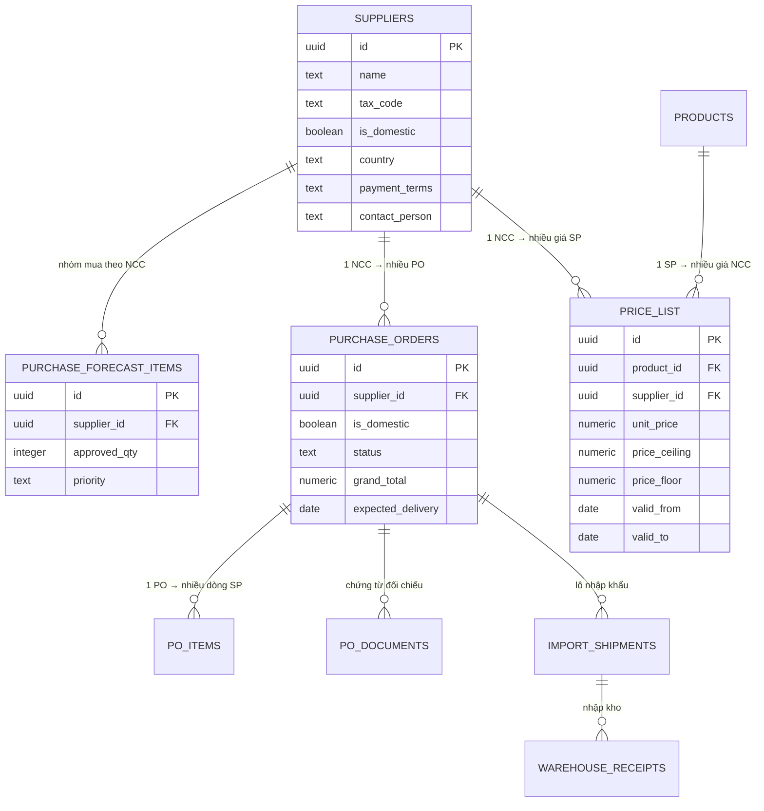
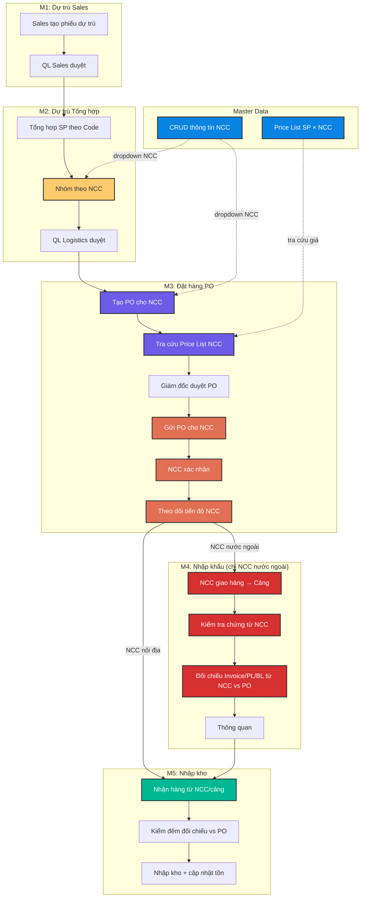
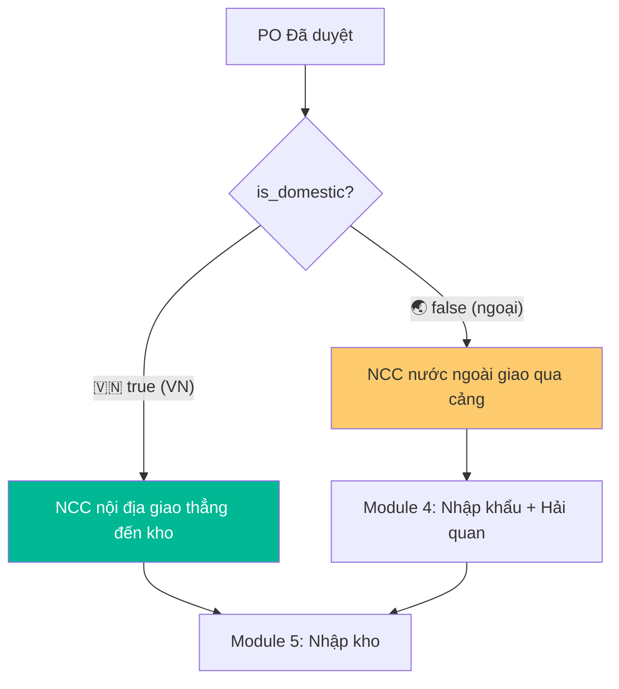

# Nhà Cung Cấp (NCC) — Vai trò & Quan hệ trong MedLogixManage

## NCC là ai?

**Nhà Cung Cấp (NCC / Supplier)** là các đơn vị bên ngoài cung cấp thiết bị y tế & dược phẩm cho công ty. NCC **KHÔNG có tài khoản** trong hệ thống — họ được quản lý như **Master Data** bởi Admin.

### 5 NCC hiện tại trong hệ thống:

| NCC | Quốc gia | Loại | Điều khoản TT |
|-----|----------|------|---------------|
| Dräger Vietnam | Germany 🌏 | Nhập khẩu | LC 90 ngày |
| B.Braun Vietnam | Germany 🌏 | Nhập khẩu | TT 60 ngày |
| Medtronic Vietnam | USA 🌏 | Nhập khẩu | LC 60 ngày |
| Việt Nhật Medical | Vietnam 🇻🇳 | Nội địa | COD |
| Dược phẩm TW 3 | Vietnam 🇻🇳 | Nội địa | TT 30 ngày |

---

## Cấu trúc dữ liệu NCC

```sql
CREATE TABLE suppliers (
  id UUID PRIMARY KEY,
  name TEXT,           -- Tên NCC
  tax_code TEXT,       -- Mã số thuế
  address TEXT,        -- Địa chỉ
  phone TEXT,          -- Số điện thoại
  email TEXT,          -- Email
  contact_person TEXT, -- Người liên hệ
  country TEXT,        -- Quốc gia
  is_domestic BOOLEAN, -- true = Nội địa, false = Nhập khẩu
  payment_terms TEXT,  -- Điều khoản thanh toán
  is_active BOOLEAN    -- Đang hoạt động
);
```

---

## Quan hệ dữ liệu — NCC liên kết với các bảng



---

## NCC xuất hiện ở đâu trong quy trình?



> [!TIP]
> Các ô có **viền đậm & màu nổi** là nơi NCC trực tiếp liên quan.

---

## Phân luồng: NCC Nội địa vs NCC Nước ngoài



---

## Chi tiết vai trò NCC theo Module

### Module 2: NCC là tiêu chí nhóm đơn hàng

- QL Logistics **chọn NCC** cho mỗi dòng SP trong dự trù
- Hệ thống gom các dòng **cùng NCC** để tạo 1 PO chung → giảm phí vận chuyển

### Module 3: NCC là đối tác nhận PO

| Bước | Ai thực hiện | NCC liên quan |
|------|-------------|---------------|
| Tạo PO | QL Logistics | Chọn NCC, xem giá NCC |
| Tra giá | Hệ thống auto | Price List theo NCC × SP |
| Duyệt PO | Giám đốc | Xem thông tin NCC |
| Gửi PO | QL Logistics | Gửi PO cho NCC (ngoài hệ thống) |
| Xác nhận | **NCC** (bên ngoài) | NCC xác nhận qua email/ĐT |
| Giao hàng | **NCC** (bên ngoài) | NCC giao hàng đến cảng/kho |

### Module 4: Chứng từ từ NCC (chỉ NCC nước ngoài)

| Chứng từ | Từ NCC? | Dùng để |
|----------|---------|---------|
| Commercial Invoice | ✅ | Đối chiếu Code, Tên, SL, Giá vs PO |
| Packing List | ✅ | Đối chiếu Code, SL, Lot, HSD vs PO |
| Bill of Lading / AWB | ✅ | Ngày giao + SL vs PO |
| Certificate of Origin | ✅ | Chứng nhận xuất xứ |
| ISO 13485 Certificate | ✅ | Chứng nhận nhà SX |
| Free Sale Certificate | ✅ | Bắt buộc cho TBYT loại C,D |

---

## Tổng kết: NCC chạm vào 5 bảng, 4 modules

| Bảng DB | Trường liên kết | Vai trò |
|---------|----------------|---------|
| `suppliers` | — | Bảng chính, Master Data |
| `purchase_forecast_items` | `supplier_id` | Nhóm dự trù theo NCC |
| `purchase_orders` | `supplier_id` + `is_domestic` | PO gửi cho NCC |
| `price_list` | `supplier_id` | Giá chuẩn theo SP × NCC |
| `import_shipments` | qua `po_id` | Lô hàng NK từ NCC nước ngoài |

| Module | Vai trò NCC |
|--------|------------|
| M2: Dự trù | Tiêu chí nhóm đơn hàng |
| M3: Đặt hàng | Đối tác nhận PO, xác nhận, giao hàng |
| M4: Nhập khẩu | Nguồn cung cấp chứng từ để cross-check |
| M5: Nhập kho | Nguồn gốc hàng hóa nhập kho |

> [!IMPORTANT]
> **NCC là thực thể bên ngoài hệ thống** — không có tài khoản, không login. Mọi tương tác NCC đều qua QL Logistics (gửi PO qua email/ĐT, nhận xác nhận, cập nhật trạng thái thủ công).
