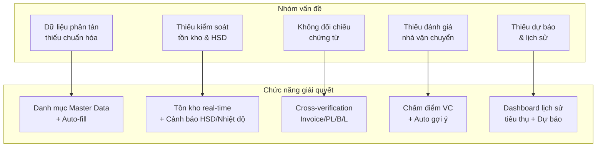
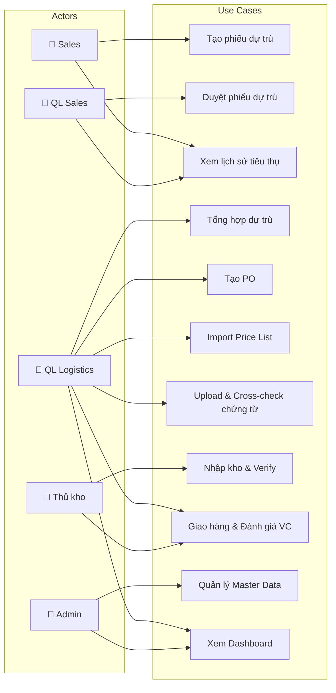

# Yêu cầu Hệ thống - MedLogixManage

## 1. Phân rã vấn đề → Chức năng

Bảng dưới ánh xạ từng **vấn đề đã nhận định** (từ business_process_analysis.md) sang **chức năng giải quyết** tương ứng.

| # | Vấn đề gốc | Module | Chức năng giải quyết | Mã FR |
|---|---|---|---|---|
| 1 | Sales ghi sai Code/Tên hàng | M1 | Auto-fill từ danh mục SP khi chọn Code | FR-1.1 |
| 2 | Phân bổ Sales chồng chéo | M1 | Kiểm tra trùng BV + Code trước khi tạo | FR-1.2 |
| 3 | Không có căn cứ duyệt | M1, M2 | Hiển thị lịch sử tiêu thụ theo BV/tháng | FR-1.3 |
| 4 | Không kiểm soát deadline | M1 | Trường ngày cần hàng + cảnh báo | FR-1.4 |
| 5 | Tổng hợp thủ công | M2 | Tự động gộp từ phiếu Sales đã duyệt | FR-2.1 |
| 6 | Không đối chiếu tồn kho | M2 | Tồn kho real-time + tồn kho khả dụng | FR-2.2 |
| 7 | Không biết HSD tồn kho | M2 | Cảnh báo HSD < 8/12 tháng, loại khỏi khả dụng | FR-2.3 |
| 8 | Không cảnh báo nhiệt độ | M2 | Cảnh báo SP yêu cầu bảo quản đặc biệt | FR-2.4 |
| 9 | Không phân biệt ưu tiên | M2 | Tự động phân mức ưu tiên (Khẩn/BT/Thấp) | FR-2.5 |
| 10 | Thiếu kiểm soát giá | M3 | Đối chiếu Price List + cảnh báo biến động | FR-3.1 |
| 11 | Không quản lý Lot/HSD | M3 | Multi-lot per code, tracking expired date | FR-3.2 |
| 12 | Không đối chiếu chứng từ | M3, M4, M5 | Cross-verify Invoice/PL/B/L tự động | FR-3.3 |
| 13 | Ngày giao không chuẩn | M3 | Lấy từ B/L + 1 ngày tự động | FR-3.4 |
| 14 | Thiếu chứng từ NK | M4 | Checklist chứng từ + block khai báo HQ | FR-4.1 |
| 15 | Không cross-check NK | M4 | Auto cross-check file upload vs PO | FR-4.2 |
| 16 | Nhập kho không đối chiếu | M5 | Auto verify sau nhập liệu vs Invoice/PL | FR-5.1 |
| 17 | Không theo FIFO/FEFO | M5 | Tự động gợi ý xuất theo HSD gần nhất | FR-5.2 |
| 18 | Giao hàng không đúng hẹn | M6 | Theo dõi trạng thái + cảnh báo trễ | FR-6.1 |
| 19 | Không đánh giá VC | M6 | Chấm điểm 5 tiêu chí + điểm tích lũy | FR-6.2 |
| 20 | Không tối ưu tuyến | M6 | Auto gợi ý VC tốt nhất theo tuyến | FR-6.3 |

---

## 2. Yêu cầu chức năng (Functional Requirements)

### Module 1: Dự trù từ Sales

| Mã | Yêu cầu | Tiêu chí chấp nhận |
|---|---|---|
| **FR-1.1** | **Auto-fill sản phẩm:** Khi Sales nhập Code hàng, hệ thống tự động điền Tên hàng, Hãng SX, Quy cách, ĐVT từ danh mục Master Data | Các trường tự điền chính xác, không cho phép nhập Code không tồn tại |
| **FR-1.2** | **Kiểm tra trùng lặp:** Cảnh báo nếu cùng Code hàng + cùng BV đã được Sales khác dự trù trong cùng kỳ | Hiển thị popup warning với thông tin phiếu trùng |
| **FR-1.3** | **Lịch sử tiêu thụ:** Khi chọn Code + BV, hiển thị bảng SL tiêu thụ thực tế của BV đó theo 12 tháng gần nhất (quý) | Dữ liệu lấy từ lịch sử giao hàng Module 6. Quản lý thấy khi duyệt |
| **FR-1.4** | **Quản lý deadline:** Bắt buộc nhập "Ngày cần hàng". Cảnh báo nếu < 15 ngày | Highlight đỏ nếu gần deadline, sắp xếp danh sách theo urgency |
| **FR-1.5** | **Workflow duyệt 2 bước:** Sales gửi → Quản lý Sales duyệt → Tự động chuyển Module 2 | Trạng thái chuyển tự động, có lý do từ chối |
| **FR-1.6** | **Dropdown bệnh viện:** Danh sách 20 BV từ validation Excel, có thể mở rộng | Tìm kiếm nhanh, hiển thị tên đầy đủ |

### Module 2: Dự trù (Tổng hợp mua hàng)

| Mã | Yêu cầu | Tiêu chí chấp nhận |
|---|---|---|
| **FR-2.1** | **Tự động tổng hợp:** Gộp tất cả phiếu Sales đã duyệt theo Code hàng, tính tổng SL | Một click tổng hợp, hiển thị chi tiết nguồn gốc từng dòng |
| **FR-2.2** | **Tồn kho real-time:** Hiển thị tồn kho hiện tại + tồn kho khả dụng (loại HSD sát) + SL đang trên đường về | Dữ liệu sync từ Module 5 + Module 4 |
| **FR-2.3** | **Cảnh báo HSD:** Tồn kho có HSD < 8 tháng → cảnh báo vàng. < 12 tháng → cảnh báo đỏ. Không tính vào tồn kho khả dụng | Badge cảnh báo trên dòng SP, tooltip chi tiết từng lô |
| **FR-2.4** | **Cảnh báo bảo quản:** SP yêu cầu nhiệt độ đặc biệt → icon cảnh báo + kiểm tra capacity kho | Hiển thị icon ❄️ bên cạnh SP cần bảo quản đặc biệt |
| **FR-2.5** | **Auto ưu tiên:** Tự động phân mức Khẩn/BT/Thấp dựa trên deadline + tồn kho | Color-coded badges, sortable theo mức ưu tiên |
| **FR-2.6** | **Đề xuất mua thêm:** Tính và hiển thị SL đề xuất bổ sung dựa trên mức tồn kho an toàn | Trường riêng, quản lý có thể chấp nhận hoặc bỏ qua |
| **FR-2.7** | **Lịch sử tiêu thụ theo BV:** Hiển thị lịch sử tiêu thụ tại từng BV cho quản lý duyệt lần 2 | Bảng readonly, drill-down theo tháng/quý |
| **FR-2.8** | **Workflow duyệt:** Trưởng phòng mua hàng duyệt → tự động tạo PO ở Module 3 | Duyệt từng dòng hoặc duyệt hàng loạt |

### Module 3: Đặt hàng (Purchase Order)

| Mã | Yêu cầu | Tiêu chí chấp nhận |
|---|---|---|
| **FR-3.1** | **Đối chiếu Price List:** Auto tra cứu giá chuẩn từ bảng giá import. Cảnh báo nếu đơn giá ≠ giá chuẩn hoặc biến động > 10% so với lần mua trước | Hiển thị giá chuẩn, giá cũ, % biến động bên cạnh ô nhập giá |
| **FR-3.2** | **Multi-Lot tracking:** Mỗi Code hàng hỗ trợ ≥ 2 Lot với Expired Date riêng biệt | Thêm/xóa dòng lot trong chi tiết PO |
| **FR-3.3** | **Cross-verify chứng từ:** Khi import Invoice/Packing List/B/L → auto so sánh Code, Tên, ĐVT, SL với PO. Hiển thị kết quả khớp/không khớp | Bảng so sánh 2 cột (PO vs Chứng từ), highlight sai lệch |
| **FR-3.4** | **Ngày giao từ B/L:** Khi import B/L/AWB → tự động lấy ngày giao và cộng 1 ngày làm "Ngày giao dự kiến" | Trường auto-fill, cho phép override thủ công |
| **FR-3.5** | **Import Price List:** Quản lý Logistics upload file bảng giá → parse và lưu vào hệ thống | Hỗ trợ Excel/CSV, validate format trước khi import |
| **FR-3.6** | **Theo dõi tiến độ:** Timeline hiển thị trạng thái PO + cảnh báo nếu NCC chậm giao | Notification khi quá hạn giao dự kiến |

### Module 4: Nhập khẩu

| Mã | Yêu cầu | Tiêu chí chấp nhận |
|---|---|---|
| **FR-4.1** | **Checklist chứng từ:** Danh sách 8 loại tài liệu (Invoice, PL, B/L, C/O, CFS, ISO, SLH, GP NK). Mỗi mục: checkbox + upload file | Block trạng thái "Khai báo HQ" nếu mục bắt buộc chưa ✅ |
| **FR-4.2** | **Auto cross-check:** Khi upload chứng từ → parse và đối chiếu tự động với thông tin PO (Code, Tên, SL, ĐVT, Lot, HSD) | Kết quả: ✅ Khớp / ⚠️ Sai lệch kèm chi tiết |
| **FR-4.3** | **Tính chi phí CIF:** Auto tính Giá CIF, Thuế NK, VAT, Tổng chi phí dựa trên các trường nhập | Công thức tính chính xác, hỗ trợ đa tiền tệ (USD→VND) |
| **FR-4.4** | **Tracking trạng thái:** 6 bước trạng thái với timestamp tự động | Timeline hiển thị tiến trình, ETA cho mỗi bước |

### Module 5: Nhập kho

| Mã | Yêu cầu | Tiêu chí chấp nhận |
|---|---|---|
| **FR-5.1** | **Auto cross-verify nhập kho:** Sau nhập liệu → hệ thống đối chiếu Code, Tên, SL, ĐVT, Lot, HSD với Invoice & Packing List đã import ở M4 | Cảnh báo sai lệch, yêu cầu xác nhận thủ công trước khi hoàn tất |
| **FR-5.2** | **FEFO xuất kho:** Khi xuất, tự động gợi ý lô có HSD gần nhất (First Expired First Out) | Sắp xếp lô theo HSD tăng dần, highlight lô cần xuất trước |
| **FR-5.3** | **Quản lý vị trí kho:** Gán vị trí (Kệ/Tầng/Ô) + điều kiện bảo quản cho mỗi lô | Map kho visual (optional), filter theo điều kiện bảo quản |
| **FR-5.4** | **Cảnh báo tồn kho:** Tồn kho ≤ mức an toàn → cảnh báo. HSD ≤ 90 ngày → cảnh báo hết hạn | Dashboard cảnh báo, notification push |
| **FR-5.5** | **Biệt trữ:** Hàng nghi ngờ chất lượng → chuyển trạng thái "Biệt trữ", tách khỏi tồn kho khả dụng | Không tính vào tồn kho Module 2, cần phê duyệt để giải phóng |

### Module 6: Vận chuyển & Giao hàng

| Mã | Yêu cầu | Tiêu chí chấp nhận |
|---|---|---|
| **FR-6.1** | **Theo dõi giao hàng:** Trạng thái real-time + cảnh báo khi quá ngày giao dự kiến | Timeline 5 bước, notification khi trễ |
| **FR-6.2** | **Chấm điểm đơn vị VC:** 5 tiêu chí (phản hồi, đúng hẹn, bom hàng, nguyên vẹn, phát sinh CP). Tính điểm TB tích lũy + xếp hạng | Form đánh giá sau giao hàng, dashboard xếp hạng VC |
| **FR-6.3** | **Auto gợi ý VC:** Khi nhập điểm giao + điểm nhận → gợi ý đơn vị VC có điểm cao nhất trên tuyến đó | Dropdown kèm điểm số + số đơn đã giao trên tuyến |
| **FR-6.4** | **Phiếu xuất kho:** Tự động tạo phiếu xuất kho, cập nhật tồn kho khi giao hàng | Tồn kho giảm ngay khi xuất, rollback nếu giao thất bại |
| **FR-6.5** | **Biên bản giao nhận:** Upload ảnh/scan biên bản, BV xác nhận SL nhận | Trường upload file, SL xác nhận vs SL giao |

### Chức năng hệ thống chung (System-wide)

| Mã | Yêu cầu | Tiêu chí chấp nhận |
|---|---|---|
| **FR-S.1** | **Danh mục Master Data:** Quản lý danh mục Sản phẩm (Code, Tên, Hãng SX, ĐVT, Quy cách, Điều kiện BQ), Bệnh viện, Nhà cung cấp, Đơn vị VC | CRUD + import/export Excel |
| **FR-S.2** | **Import bảng giá (Price List):** QL Logistics upload file giá chuẩn cho từng mã hàng. Lịch sử giá lưu lại | Parse Excel/CSV, validate, lưu version |
| **FR-S.3** | **Import chứng từ & parse:** Upload Invoice/PL/B/L → hệ thống trích xuất thông tin cho cross-check | Hỗ trợ PDF/Excel, manual input fallback |
| **FR-S.4** | **Dashboard tổng quan:** KPI: Tổng đơn chờ, Giá trị tồn kho, % giao đúng hẹn, SP sắp hết hạn. Pipeline visualization | Realtime, filterable theo thời gian |
| **FR-S.5** | **Lịch sử tiêu thụ:** Thống kê SL tiêu thụ theo Code hàng × BV × Tháng/Quý từ dữ liệu giao hàng | Chart + table, export được |
| **FR-S.6** | **Audit trail:** Ghi log mọi thao tác: ai, khi nào, thay đổi gì | Log viewer, filter theo user/module/thời gian |
| **FR-S.7** | **Thông báo & cảnh báo:** Push notification cho: deadline sắp tới, HSD sắp hết, đơn chậm, chứng từ thiếu | In-app notification center |

---

## 3. Yêu cầu phi chức năng (Non-Functional Requirements)

### 3.1 Hiệu năng (Performance)

| Mã | Yêu cầu | Chỉ tiêu |
|---|---|---|
| **NFR-P.1** | Thời gian phản hồi trang | ≤ 2 giây cho mỗi trang load |
| **NFR-P.2** | Thời gian cross-check chứng từ | ≤ 5 giây cho mỗi file upload |
| **NFR-P.3** | Dashboard load | ≤ 3 giây với dữ liệu 12 tháng |
| **NFR-P.4** | Concurrent users | Hỗ trợ ≥ 20 người dùng đồng thời |
| **NFR-P.5** | Import file | Xử lý file Excel ≤ 10MB trong ≤ 10 giây |

### 3.2 Bảo mật (Security)

| Mã | Yêu cầu | Chỉ tiêu |
|---|---|---|
| **NFR-S.1** | Xác thực người dùng | Login username/password, session management |
| **NFR-S.2** | Phân quyền theo vai trò | Sales chỉ thấy phiếu mình, Quản lý thấy tất cả, Admin full quyền |
| **NFR-S.3** | Bảo vệ dữ liệu | Mã hóa data nhạy cảm (giá, chi phí) |
| **NFR-S.4** | Audit logging | Không xóa log, chỉ admin xem |

### 3.3 Khả dụng & Độ tin cậy (Availability & Reliability)

| Mã | Yêu cầu | Chỉ tiêu |
|---|---|---|
| **NFR-R.1** | Uptime | ≥ 99% trong giờ hành chính (8h-18h) |
| **NFR-R.2** | Sao lưu dữ liệu | Backup tự động hàng ngày, restore ≤ 30 phút |
| **NFR-R.3** | Tồn tại dữ liệu | Dữ liệu persist qua localStorage + export JSON (MVP) |
| **NFR-R.4** | Error handling | Lỗi hệ thống không mất dữ liệu đang nhập |

### 3.4 Khả năng sử dụng (Usability)

| Mã | Yêu cầu | Chỉ tiêu |
|---|---|---|
| **NFR-U.1** | Responsive design | Hoạt động trên Desktop ≥ 1280px, Tablet ≥ 768px |
| **NFR-U.2** | Ngôn ngữ | Giao diện Tiếng Việt hoàn toàn |
| **NFR-U.3** | Học sử dụng | Nhân viên mới sử dụng được sau ≤ 30 phút hướng dẫn |
| **NFR-U.4** | Accessibility | Contrast ratio ≥ 4.5:1, font size ≥ 14px |
| **NFR-U.5** | Feedback trực quan | Toast notification, loading states, error messages rõ ràng |

### 3.5 Tuân thủ quy định (Compliance)

| Mã | Yêu cầu | Chỉ tiêu |
|---|---|---|
| **NFR-C.1** | GSP (TT 36/2018) | Truy xuất Lot + HSD, điều kiện bảo quản, FEFO |
| **NFR-C.2** | GDP (TT 03/2018) | Hồ sơ vận chuyển, điều kiện VC, biên bản giao nhận |
| **NFR-C.3** | NĐ 98/2021 | Phân loại TBYT A-D, số lưu hành, checklist chứng từ NK |
| **NFR-C.4** | ISO 13485 | Truy xuất nguồn gốc end-to-end (PO → Lot → BV) |

### 3.6 Khả năng mở rộng (Scalability)

| Mã | Yêu cầu | Chỉ tiêu |
|---|---|---|
| **NFR-X.1** | Dữ liệu | Lưu trữ ≥ 5,000 SP, ≥ 1,000 PO, ≥ 10,000 phiếu giao |
| **NFR-X.2** | Mở rộng BV | Thêm BV mới mà không cần sửa code |
| **NFR-X.3** | Mở rộng NCC | Thêm NCC mới qua Master Data |
| **NFR-X.4** | Export | Xuất dữ liệu ra Excel/PDF cho báo cáo |

---

## 4. Ma trận vai trò – chức năng (RACI)

| Chức năng | Sales | QL Sales | QL Logistics | Thủ kho | Admin |
|---|---|---|---|---|---|
| Tạo phiếu dự trù (M1) | **R** | A | I | | |
| Duyệt phiếu dự trù (M1) | I | **R/A** | I | | |
| Tổng hợp dự trù (M2) | | I | **R/A** | | |
| Duyệt mua hàng (M2) | | | **R/A** | | |
| Tạo/quản lý PO (M3) | | | **R** | | A |
| Import Price List (M3) | | | **R/A** | | |
| Quản lý nhập khẩu (M4) | | | **R/A** | | |
| Upload chứng từ (M4) | | | **R** | | |
| Nhập kho (M5) | | | I | **R/A** | |
| Xuất kho & giao hàng (M6) | | | **R** | **R** | A |
| Đánh giá VC (M6) | | | **R/A** | | |
| Master Data (S) | | | | | **R/A** |
| Dashboard (S) | C | C | **R** | C | A |

**R** = Responsible, **A** = Accountable, **I** = Informed, **C** = Consulted

---

## 5. Sơ đồ Use Case tổng thể

